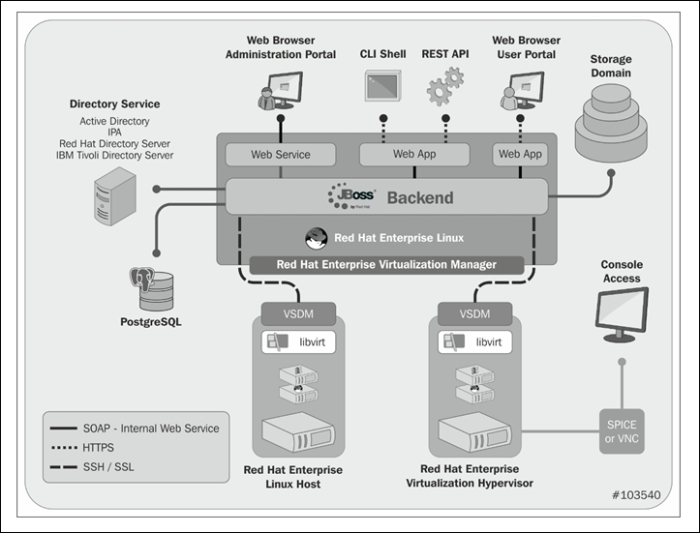

////
NO CAMBIAR!!
Codificación, idioma, tabla de contenidos, tipo de documento 
////							    
:encoding: utf-8					   
:lang: es						
:toc: right                                           
:toc-title: Tabla de contenidos                   
:doctype: book
:imagesdir: ./

////
Nombre y título del trabajo
////
# Ficha Técnica
Red Hat Virtualization Manager
:numbered!:

== Información
|===		
.4+^|image:hf.png[imagen,120,130,float="center",align="center"]                                      3+^|*{{ ansible_fqdn }} - Ficha Técnica*
3+| *Ambiente:* {{ var_tipo_servicio }}  								
2+| *Fecha:* {{ ansible_date_time.weekday }} {{ ansible_date_time.day }}  {{ ansible_date_time.year }}  |*Emisón:* {{ ansible_date_time.weeknumber }} 
3+| *Hora:* {{ da.stdout }}  
|===	

=== Resumen Ejecutivo

La tecnología líder del sector, el rendimiento de nivel empresarial, la escalabilidad y la seguridad al menor precio, y el ecosistema más amplio de proveedores de hardware hacen de Red Hat Enterprise Virtualization la opción de plataforma clara para las empresas que buscan proteger sus inversiones actuales en tecnología de virtualización y se extienden al futuro basado en la nube.

<<<<
=== Red Hat Enterprise Virtualization para servidores consta de los siguientes dos componentes:

*Red Hat Enterprise Virtualization Manager para servidores:* Un sistema de administración de virtualización de servidor rico en características que proporciona capacidades avanzadas para anfitriones e invitados.

*Red Hat Enterprise Virtualization Hypervisor:* Un hipervisor moderno basado en KVM que se puede implementar ya sea como un hipervisor Bare-Metal independiente o como Red Hat Enterprise Linux. Un solo hipervisor instalado en un servidor físico permite la instalación de varios sistemas operativos en el hipervisor que se pueden ejecutar simultáneamente como máquinas virtuales.

.Red Hat Enterprise Virtualization para servidores ofrece:
- Funcionalidad de administración integral, que incluye migración en vivo, alta disponibilidad, Power Manager, programador del sistema y mucho más.
- Relaciones de consolidación y rendimiento inigualables.
- Menor costo de propiedad entre las plataformas de virtualización empresarial.
- Soporte para invitados Windows y Linux.

Compatibilidad total con Red Hat Enterprise Linux y el ecosistema completo de Partners de Red Hat para la virtualización de aplicaciones de misión crítica.

Red Hat Enterprise Virtualization Manager para servidores permite a las empresas administrar de forma centralizada todo el entorno virtual de sus centros de datos virtuales, clústeres, hosts, servidores virtuales invitados, redes y almacenamiento. 

<<<<
=== Arquitectura de alto nivel.
Muestra una representación gráfica del entorno de Red Hat Enterprise Virtualization.

 

<<<<
=== Entorno de Red Hat Enterprise Virtualization

Red Hat Enterprise Virtualization para servidores consta del administrador de RHEV, que se utiliza para controlar el entorno y los hosts. Los hosts constan de servidores que se han implementado con el hipervisor KVM. 

El hipervisor se puede implementar como una configuración independiente o integrado con un sistema instalado con Red Hat Enterprise Linux 7.

*Host* es un servidor físico que proporciona la CPU, la memoria y la conectividad al almacenamiento y las redes que se usan para las máquinas virtuales (VM). El almacenamiento local del host autónomo se utiliza solamente para sostener el hipervisor RHEV.

*Clúster* es un grupo de hosts de arquitectura similar. El requisito de una arquitectura similar permite que una máquina virtual se migre del host al host en el clúster sin tener que apagar y reiniciar la máquina virtual. Un clúster consta de uno o varios hosts, pero un host solo puede ser miembro de un clúster.

*Datacenter* es una colección de uno o más clusters que tienen recursos en común. Los recursos que se han asignado a un centro de datos solo los pueden utilizar los hosts pertenecientes a ese centro de datos. Los recursos se relacionan con el almacenamiento y las redes

.El almacenamiento se divide en dos categorías.
- Almacenamiento utilizado para contener imágenes ISO de CD y DVD y las imágenes de disquete que se pueden usar para instalar las máquinas virtuales.
- Los datos, el segundo tipo de almacenamiento, se usan para las imágenes de disco de las máquinas virtuales, las instantáneas y el almacenamiento de las plantillas.

<<<<
=== Requisitos del Sistema
==== Requisitos de Red Hat Virtualization Manager

|====
2+^|*Hardware RHVM*
|*CPU:*               | 8 cpu´s
|*Memoria Ram:*       | 32 GB
|*Almacenamiento:*    | 150 GB
|*Intefaz de red:*    | 1 Interfaces de red
|====

==== Requisitos del Navegador

|====
4+^|*Requisitos de Navegador*
^|*Nivel de Soporte* ^|*Familia de sistemas operativos* ^|*Navegador* ^|*Acceso al Portal*
^|Nivel 1| Red Hat Enterprise Linux| Versión de Mozilla Firefox Extended Support Release (ESR) .5+^.^|Portal de Administración y Portal de Usuario
^|Nivel 2| Windows| Internet Explorer 10 o Posterior
.3+^.^|Nivel 3| Cualquiera| Versión más reciente de Google Chrome o Mozilla Firefox.
| Cualquiera| Versiones anteriores de Google Chrome o Mozilla Firefox
| Cualquiera| Otros navegadores
|====

|====
2+^|*El soporte del navegador se divide en niveles*
|*Nivel de soporte*               | *Especificaciones*
|*Nivel 1*       		  | Combinaciones de navegador y sistema operativo que están totalmente probadas y son totalmente compatibles.
|*Nivel 2*    			  | Combinaciones de navegador y sistema operativo que están parcialmente probadas y es probable que funcionen.
|*Nivel 3*    			  | Combinaciones de navegador y sistema operativo que no se han probado, pero pueden funcionar.
|====

==== Cliente
|====
2+^|*Soporte de SPICE*
|*Nivel de soporte*               | *Característica*
|*Nivel 1*                        | Sistemas operativos en los que Remote Viewer ha sido completamente probado y es compatible.
|*Nivel 2*                        | Sistemas operativos en los que Remote Viewer está parcialmente probado y es probable que funcione
|====

|====
2+^|*Descargar e instalar Viewer en Windows*
|*32 bits*                        | https://rhvem07.interno.imss.mx/ovirt-engine/services/files/spice/virt-viewer-x86.msi
|*64 bits*                        | https://rhvem07.interno.imss.mx/ovirt-engine/services/files/spice/virt-viewer-x64.msi
2+^|*Instalando usbdk en Windows*
|*32 bits*                        | https://rhvem07.interno.imss.mx/ovirt-engine/services/files/spice/usbdk-x86.msi 
|*64 bits*                        | https://rhvem07.interno.imss.mx/ovirt-engine/services/files/spice/usbdk-x64.msi
2+^|*Instalación de Remote Viewer en Linux*
2+|# yum install virt-viewer
2+|La aplicación Remote Viewer proporciona a los usuarios una consola gráfica para conectarse a máquinas virtuales. 
2+|Usbdk es un controlador que permite el remote-viewer acceso exclusivo a dispositivos USB en sistemas operativos Windows.
|====

|====
^|*Notas*
|Red Hat Virtualization Manager y todos los hosts (Red Hat Virtualization Host y Red Hat Enterprise Linux host) deben tener un nombre de dominio completo y una resolución de nombres completa, perfectamente alineada hacia adelante y hacia atrás.
|La ejecución de un servicio DNS como una máquina virtual en el entorno de virtualización de Red Hat no es compatible. Todos los servicios DNS que utiliza el entorno de virtualización de Red Hat deben estar alojados fuera del entorno.
|Red Hat recomienda encarecidamente utilizar DNS en lugar del /etc/hosts archivo para la resolución de nombres. El uso de un archivo hosts normalmente requiere más trabajo y tiene una mayor probabilidad de errores.
|====

<<<<
=== Requisitos FIrewall
==== Red Hat Virtualization Manager

|====
6+^|*Red Hat Virtualization Manager Firewall Requerimientos*
^|*ID* ^|*Puertos* ^|*Protocolo* ^|*fuente* ^|*destino* ^|*propósito*   
|M1 | - 	| ICMP | Hosts de virtualización de Red Hat Red Hat Enterprise Linux hosts | Red Hat Virtualization Manager | Puede ayudar en el diagnóstico.								
|M2 | 22 	| TCP  | Sistema (s) utilizado para el mantenimiento del Administrador, incluida la configuración del servidor y las actualizaciones de software | Red Hat Virtualization Manager | Acceso Secure Shell (SSH)
|M3 | 2222 	| TCP  | Clientes que acceden a consolas seriales de máquinas virtuales | Red Hat Virtualization Manager | Acceso de Secure Shell (SSH) para permitir la conexión a consolas seriales de máquinas virtuales.
|M4 | 80, 443 	| TCP  | Administration Portal clients VM Portal clients Hosts de virtualización de Red Hat Red Hat Enterprise Linux hosts Clientes REST API | Red Hat Virtualization Manager | Proporciona acceso HTTP y HTTPS al Administrador.
|M5 | 6100 	| TCP  | Administration Portal clients VM Portal clients | Red Hat Virtualization Manager | Proporciona acceso de proxy websocket para un cliente de consola basado en web noVNC, cuando el proxy websocket se ejecuta en el Administrador. Si el proxy websocket se ejecuta en un host diferente, sin embargo, este puerto no se utiliza.
|M6 | 7410  	| UDP  | Hosts de virtualización de Red Hat Red Hat Enterprise Linux hosts | Red Hat Virtualization Manager | Si Kdump está habilitado en los hosts, abra este puerto para la escucha de fence_kdump en el Administrador. Ver fence_kdump Configuración avanzada
|M7 | 54323 	| TCP  | Administration Portal clients | Red Hat Virtualization Manager (servidor proxy de ImageIO) | Requerido para la comunicación con el Proxy de ImageIO (ovirt-imageio-proxy).
|M8 | 6442 	| TCP  | Hosts de virtualización de Red Hat Red Hat Enterprise Linux hosts | Red virtual abierta (OVN) base de datos en dirección sur | Conectarse a la base de datos de red virtual abierta (OVN)
|M9 | 9696 	| TCP  | Clientes de proveedor de red externa para OVN | Proveedor de red externa para OVN | API de red de OpenStack
|M10 | 35357 	| TCP  | Clientes de proveedor de red externa para OVN | Proveedor de red externa para OVN | API de identidad de OpenStack 
|M11 | 53 	| TCP/UDP  | Red Hat Virtualization Manage | Servidor DNS | Solicitudes de búsqueda de DNS desde los puertos superiores a 1023 al puerto 53, y respuestas. Abrir por defecto
|M12 | 123 	| UDP      | Red Hat Virtualization Manage | Servidor NTP | Las solicitudes NTP de los puertos superiores a 1023 al puerto 123, y las respuestas. Abrir por defecto.
|====

<<<<

==== Red Hat Virtualization Hypervisor

|====
6+^|* Requisitos de Firewall de Host de Virtualización*
^|*ID* ^|*Puertos* ^|*Protocolo* ^|*fuente* ^|*destino* ^|*propósito*
|H1	| 22	| TCP	| RVM	| Hosts de virtualización de Red Hat Red Hat Enterprise Linux hosts | Acceso Secure Shell (SSH).
|H2	| 2223	| TCP	| RHM	| Hosts de virtualización de Red Hat Red Hat Enterprise Linux hosts | Acceso de Secure Shell (SSH) para permitir la conexión a consolas seriales de máquinas virtuales.
|H3	| 161	| UDP	| Hosts de virtualización de Red Hat Red Hat Enterprise Linux hosts	| Red Hat Virtualization Manager | Protocolo simple de gestión de red (SNMP). Solo es necesario si desea que las capturas del Protocolo simple de administración de red se envíen desde el host a uno o más administradores SNMP externos.
|H4	| 111	| TCP	| Servidor de almacenamiento NFS	| Hosts de virtualización de Red Hat Red Hat Enterprise Linux hosts | Conexiones NFS.
|H5	| 5900 - 6923 	| TCP		| Administration Portal clients VM Portal clients	| Hosts de virtualización de Red Hat Red Hat Enterprise Linux hosts  | Acceso remoto a la consola de invitados a través de VNC y SPICE. Estos puertos deben estar abiertos para facilitar el acceso de los clientes a las máquinas virtuales.
|H6	| 5989		| TCP, UDP	| Administrador de objetos de modelo de información común (CIMOM)	| Hosts de virtualización de Red Hat Red Hat Enterprise Linux hosts | Utilizado por los administradores de objetos del modelo de información común (CIMOM) para monitorear las máquinas virtuales que se ejecutan en el host Solo es necesario si desea utilizar un CIMOM para monitorear las máquinas virtuales en su entorno de virtualización.
|H7	| 9090		| TCP	| Red Hat Virtualization Manager Maquinas cliente.	| Hosts de virtualización de Red Hat Red Hat Enterprise Linux hosts | Necesario para acceder a la interfaz de usuario de Cockpit, si está instalado.
|H8	| 16514		| TCP	| Hosts de virtualización de Red Hat Red Hat Enterprise Linux hosts	| Hosts de virtualización de Red Hat Red Hat Enterprise Linux hosts | Migración de máquinas virtuales utilizando libvirt.
|H9	| 49152 - 49216	| TCP	| Hosts de virtualización de Red Hat Red Hat Enterprise Linux hosts	| Hosts de virtualización de Red Hat Red Hat Enterprise Linux hosts | Migración y cercado de máquinas virtuales mediante VDSM. Estos puertos deben estar abiertos para facilitar la migración automatizada y manual de las máquinas virtuales.
|H10	| 54321		| TCP	| Red Hat Virtualization Manager Hosts de virtualización de Red Hat Red Hat Enterprise Linux hosts	| Hosts de virtualización de Red Hat Red Hat Enterprise Linux hosts | Comunicaciones VDSM con el Administrador y otros hosts de virtualización.
|H11	| 54322		| TCP	| Red Hat Virtualization Manager (servidor proxy de ImageIO)	| Hosts de virtualización de Red Hat Red Hat Enterprise Linux hosts | Necesario para la comunicación con el daemon de ImageIO (ovirt-imageio-daemon ).
|H12	| 6081		| UDP	| Hosts de virtualización de Red Hat Red Hat Enterprise Linux hosts	| Hosts de virtualización de Red Hat Red Hat Enterprise Linux hosts | Requerido, cuando se utiliza la Red virtual abierta (OVN) como proveedor de red, para permitir que OVN cree túneles entre hosts.
|H13	| 53		| TCP, UDP	| Hosts de virtualización de Red Hat Red Hat Enterprise Linux hosts	| Servidor DNS | Solicitudes de búsqueda de DNS desde los puertos superiores a 1023 al puerto 53, y respuestas. Este puerto es obligatorio y está abierto por defecto.
|H14	| 123		| UDP		| Hosts de virtualización de Red Hat Red Hat Enterprise Linux hosts	| Servidor NTP | Las solicitudes NTP de los puertos superiores a 1023 al puerto 123, y las respuestas. Este puerto es obligatorio y está abierto por defecto.
|====

<<<<
==== Servidor de Base de Datos

==== Cliente
|====
6+^|*Requisitos de Firewall del servidor de base de datos*
^|*ID* ^|*Puertos* ^|*Protocolo* ^|*fuente* ^|*destino* ^|*propósito*
|D1 | 5432 | TCP, UDP | Red Hat Virtualization Manager. Servicio de almacenamiento de datos. |Administrador de engine base de datos ( ) servidor. Data Warehouse ( ovirt-engine-history) servidor de base de datos. | Puerto predeterminado para conexiones de base de datos PostgreSQL.
|D2 | 5432 | TCP, UDP | Sistemas externos | Data Warehouse (ovirt-engine-history) servidor de base de datos | Puerto predeterminado para conexiones de base de datos PostgreSQL.
6+^| Red Hat Virtualization admite el uso de un servidor de base de datos remoto para la base de datos de Manager ( engine) y la base de datos de Data Warehouse
( ovirt-engine-history)
|====

<<<<
=== Datos de implementación

